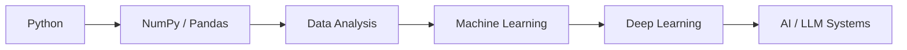

<!-- Banner -->


<div align="center">

[](https://github.com/dc-onecallaway)

<p>
  <a href="https://www.linkedin.com/in/chauhan-deepak/"></a>
  <a href="https://leetcode.com/u/dc_one_call_away/"></a>
  <a href="https://codeforces.com/profile/chauhandeepak21103"></a>
  <a href="https://www.codechef.com/users/dc_one_call_aw"></a>
</p>


</div>

---

## 👋 About Me

```cpp
struct Deepak {
    string university = "Delhi Technological University (DTU)";
    string degree     = "B.Tech, Mathematics & Computing";
    vector<string> interests = {"Software Engineering", "AI/ML", "Algorithms", "Systems"};
    string motto      = "Build. Solve. Learn. Repeat.";
};
```

- ♟️ Building a **chess engine** in C++ from scratch
- 🏆 **700+** competitive programming problems solved
- 🌐 Comfortable with **full-stack web development**
- 🤖 Currently leveling up in **Python, ML & AI**

---

## 🛠️ Tech Stack

<div align="center">

**Languages**


**Web**


**AI / ML**


**Tools**


</div>

---

## 🚀 Featured Projects

<table>
<tr>
<td width="50%" valign="top">

### ♟️ Chess Engine
UCI-compatible engine in **C++** focused on fast search, move generation and board representation.

- Bitboards & Magic Bitboards
- Legal Move Generation
- Alpha-Beta + Quiescence Search
- Iterative Deepening
- Zobrist Hashing & Transposition Tables
- Hash Move Ordering, MVV-LVA
- Perft Testing


</td>
<td width="50%" valign="top">

### 🏠 Wanderlust
Full-stack Airbnb-style property listing platform.

- Authentication & Authorization
- Listings CRUD
- Image upload (Cloudinary)
- Interactive maps (Mapbox)
- Reviews & Ratings
- Server-side validation


[🔗 View Repository](https://github.com/dc-onecallaway/air-bnb-repo)

</td>
</tr>
<tr>
<td width="50%" valign="top">

### 🧠 Brain Tumor MRI Classification
CNN that classifies MRI scans into `Glioma` · `Meningioma` · `Pituitary` · `No Tumor`.

- **~90%** test accuracy
- Image preprocessing
- Precision, Recall & F1 analysis


</td>
<td width="50%" valign="top">

### 🗄️ Restaurant Management System
Desktop application for managing restaurant operations.

- Java + JDBC
- MySQL backend


</td>
</tr>
</table>

---

## 🏆 Competitive Programming

<div align="center">

| Platform | Rating / Rank |
|:--------:|:-------------:|
| **LeetCode** | 1711 |
| **Codeforces** | 1340 |
| **CodeChef** | 3★ |
| **Total solved** | 700+ |

`Data Structures` · `Algorithms` · `DP` · `Graphs` · `Greedy` · `Binary Search` · `Number Theory` · `Mathematics`

</div>

---

## 🌱 Currently Learning



Also sharpening: **DSA · OS · DBMS · Computer Networks · OOP · System Design**

---

## 📊 GitHub Stats

<div align="center">
  
  
  <br/>
  
</div>

---

<div align="center">

### *Build. Solve. Learn. Repeat.*


</div>
